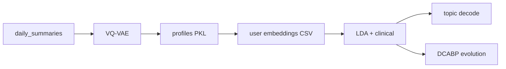

# Remote monitoring of behavioral–physiologic trajectories predict progression and reflect biologic host state in metastatic cancer in women

This repository contains the code, analysis-ready data, and workflows used in the study on remote monitoring of behavioral and physiologic trajectories in patients with metastatic cancer.

## Authors

Leire Paz<sup>1,\*</sup>, Leonardo Garma<sup>2,\*</sup>, Sonia Pernas<sup>3,4</sup>, Juan Antonio Guerra<sup>5</sup>, Rosario García-Campelo<sup>6</sup>, Jacobo Rogado<sup>7</sup>, David Vicente-Baz<sup>8</sup>, Josefa Terrasa<sup>9</sup>, Begoña Bermejo<sup>10</sup>, Ruth Vera<sup>11</sup>, Santiago González Santiago<sup>12</sup>, Sandra Gallach<sup>13,14,15</sup>, Berta Nasarre<sup>5</sup>, Bartomeu Fullana<sup>3</sup>, Desirée Jiménez<sup>2</sup>, Cristina Reboredo-Rendo<sup>6</sup>, Oscar Padilla<sup>3</sup>, Rodrigo Oliver<sup>1</sup>, Cristina Simarro<sup>8</sup>, Antonia Perelló<sup>9</sup>, Berta Hernández-Martín<sup>10</sup>, Aída Morillas<sup>2</sup>, Silvana Mourón<sup>2</sup>, María J. Bueno<sup>2</sup>, Antonio Lopez<sup>2</sup>, Pablo Martínez Olmos<sup>1</sup>, Silvia Calabuig<sup>13,14,15</sup>, Ramon Colomer<sup>7,16</sup>, Antonio Artes<sup>1</sup>, Miguel Quintela-Fandino<sup>2,7</sup>

## Affiliations

1. Communications and Signal Theory, Escuela Politécnica Superior, Universidad Carlos III, Leganés (Madrid), Spain
2. Breast Cancer Clinical Research Unit, CNIO – Spanish National Cancer Research Center, Madrid, Spain
3. Breast Cancer Unit, Department of Medical Oncology, Institut Català d’Oncologia, L’Hospitalet de Llobregat (Barcelona), Spain
4. Institut d’Investigació Biomèdica de Bellvitge (IDIBELL), L’Hospitalet de Llobregat (Barcelona), Spain
5. Medical Oncology, Hospital Universitario de Fuenlabrada, Fuenlabrada (Madrid), Spain
6. Medical Oncology, Complejo Hospitalario Universitario de A Coruña – CHUAC, A Coruña, Spain
7. Medical Oncology, Hospital Universitario de La Princesa, Madrid, Spain
8. Medical Oncology, Hospital Universitario Virgen de la Macarena, Sevilla, Spain
9. Medical Oncology, Hospital Universitari Son Espases, Palma, Spain
10. Medical Oncology, Hospital Clínico Universitario, Valencia, Spain
11. Medical Oncology, Hospital Universitario de Navarra, Navarra, Spain
12. Medical Oncology, Hospital San Pedro de Alcántara – Complejo Hospitalario Universitario de Cáceres, Cáceres, Spain
13. Department of Pathology, Universitat de València, Valencia, Spain
14. Centro de Investigación Biomédica en Red Cáncer (CIBERONC), Madrid, Spain
15. Molecular Oncology Laboratory, Fundación Investigación Hospital General Universitario de Valencia, Valencia, Spain
16. Roche Endowed Chair of Precision and Personalized Medicine, Universidad Autónoma de Madrid, Madrid, Spain

## Repository structure

```
.
├── data/                         # Datasets (see data/README.md)
├── models/
│   ├── vq-vae/
│   └── lda/
├── notebooks/
│   ├── Figures/                       # manuscript figure notebooks (Figure1–Figure6)
│   └── vq-vae_lda_pipeline/           # VQ-VAE → LDA pipeline (5 notebooks)
├── scripts/
│   ├── vqvae/                    # VQ-VAE package (model, inference, plots)
│   ├── 01_preprocess/            # Daily-summary cleaning; eB2 column rename
│   ├── 02_univariate_analysis/   # E.PD vs no-E.PD univariate plots
│   ├── 03_analysis/              # lda/, vq-vae/, alarm/ (rolling burden)
│   └── 04_figures/
├── results/
│   ├── lda/                      # figures/, tables/
│   ├── univariate/
│   └── vq-vae/
├── requirements.txt
└── LICENSE
```

Folder-level notes: [`data/README.md`](data/README.md), [`scripts/README.md`](scripts/README.md), [`results/README.md`](results/README.md), [`notebooks/Figures/README.md`](notebooks/Figures/README.md).

---

## Analysis guide

### Environment

```bash
python3 -m venv .venv
source .venv/bin/activate   # Windows: .venv\Scripts\activate
pip install -r requirements.txt
```

Open notebooks under `notebooks/vq-vae_lda_pipeline/` with the same interpreter (e.g. select the `.venv` kernel in Jupyter).

### Main pipeline (notebooks)

End-to-end workflow: **daily wearable summaries → VQ-VAE day-type profiles → LDA topics (DCABPs) → behavioral decoding → temporal evolution**.

All notebooks live in [`notebooks/vq-vae_lda_pipeline/`](notebooks/vq-vae_lda_pipeline/). Run them **in order** (repo root is detected automatically from that folder). See also [`notebooks/vq-vae_lda_pipeline/README.md`](notebooks/vq-vae_lda_pipeline/README.md).



| Step | Notebook | What it does |
|------|----------|--------------|
| 1 | [`daily_to_profiles.ipynb`](notebooks/vq-vae_lda_pipeline/daily_to_profiles.ipynb) | Runs trained **VQ-VAE** on daily summaries → discrete **day-type profiles** per day |
| 2 | [`profiles_pkl_to_csv.ipynb`](notebooks/vq-vae_lda_pipeline/profiles_pkl_to_csv.ipynb) | Builds LDA-ready embedding sequences from the profiles PKL |
| 3 | [`profiles_to_dcabp.ipynb`](notebooks/vq-vae_lda_pipeline/profiles_to_dcabp.ipynb) | **LDA** topics, clinical merge, topic distributions by progression status |
| 4 | [`profile_decodification.ipynb`](notebooks/vq-vae_lda_pipeline/profile_decodification.ipynb) | Decodes top profile tokens per topic into **behavioral features** |
| 5 | [`lda_dcabp_evolution.ipynb`](notebooks/vq-vae_lda_pipeline/lda_dcabp_evolution.ipynb) | Monthly and per-patient **DCABP** evolution over time |

Input and output paths under `data/` are listed in [`data/README.md`](data/README.md). Figures and tables go to `results/lda/`.


---

## Data and privacy

Study datasets are described in [`data/README.md`](data/README.md). They are processed and anonymized in line with applicable regulations and informed consent.

## License

Code is under the [Apache License 2.0](LICENSE). Data may have additional use conditions; see `data/README.md`.

## Citation

If you use this material, please cite the manuscript (bibliographic reference pending publication).
