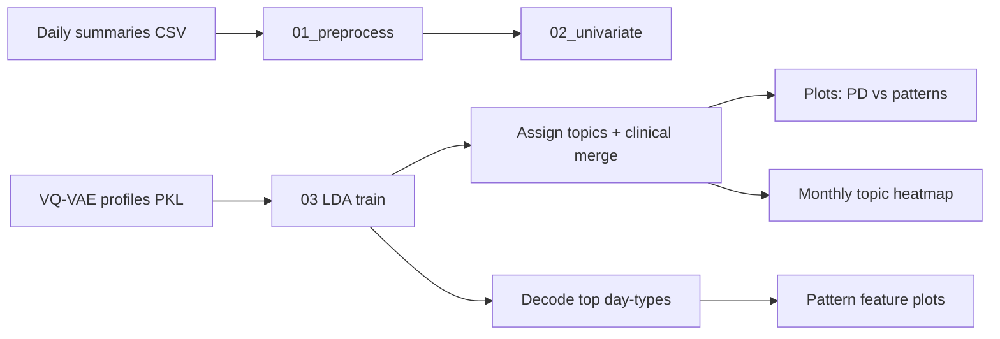

# Remote monitoring of behavioral–physiologic trajectories predict progression and reflect biologic host state in metastatic cancer in women

This repository contains the code, analysis-ready data, and workflows used in the study on remote monitoring of behavioral and physiologic trajectories in patients with metastatic cancer.

## Authors

<sup>\*</sup> LP and LG contributed equally to this manuscript.

Leire Paz<sup>1,\*</sup>, Leonardo Garma<sup>2,\*</sup>, Sonia Pernas<sup>3,4</sup>, Juan Antonio Guerra<sup>5</sup>, Rosario García-Campelo<sup>6</sup>, Jacobo Rogado<sup>7</sup>, David Vicente-Baz<sup>8</sup>, Josefa Terrasa<sup>9</sup>, Begoña Bermejo<sup>10</sup>, Ruth Vera<sup>11</sup>, Santiago González Santiago<sup>12</sup>, Sandra Gallach<sup>13,14,15</sup>, Berta Nasarre<sup>5</sup>, Bartomeu Fullana<sup>3</sup>, Desirée Jiménez<sup>2</sup>, Cristina Reboredo-Rendo<sup>6</sup>, Oscar Padilla<sup>3</sup>, Rodrigo Oliver<sup>1</sup>, Cristina Simarro<sup>8</sup>, Antonia Perelló<sup>9</sup>, Berta Hernández-Martín<sup>10</sup>, Aída Morillas<sup>2</sup>, Silvana Mourón<sup>2</sup>, María J. Bueno<sup>2</sup>, Antonio Lopez<sup>2</sup>, Pablo Martínez Olmos<sup>1</sup>, Silvia Calabuig<sup>13,14,15</sup>, Ramon Colomer<sup>7,16</sup>, Antonio Artes<sup>1</sup>, Miguel Quintela-Fandino<sup>2,7</sup>

## Affiliations

1. Communications and Signal Theory, Escuela Politécnica Superior, Universidad Carlos III, Leganés (Madrid), Spain
2. Breast Cancer Clinical Research Unit, CNIO – Spanish National Cancer Research Center, Madrid, Spain
3. Breast Cancer Unit, Department of Medical Oncology, Institut Català d’Oncologia, L’Hospitalet de Llobregat (Barcelona), Spain
4. Institut d’Investigació Biomèdica de Bellvitge (IDIBELL), L’Hospitalet de Llobregat (Barcelona), Spain
5. Medical Oncology, Hospital Universitario de Fuenlabrada, Fuenlabrada (Madrid), Spain
6. Medical Oncology, Complejo Hospitalario Universitario de A Coruña – CHUAC, A Coruña, Spain
7. Medical Oncology, Hospital Universitario de La Princesa, Madrid, Spain
8. Medical Oncology, Hospital Universitario Virgen de la Macarena, Sevilla, Spain
9. Medical Oncology, Hospital Universitari Son Espases, Palma, Spain
10. Medical Oncology, Hospital Clínico Universitario, Valencia, Spain
11. Medical Oncology, Hospital Universitario de Navarra, Navarra, Spain
12. Medical Oncology, Hospital San Pedro de Alcántara – Complejo Hospitalario Universitario de Cáceres, Cáceres, Spain
13. Department of Pathology, Universitat de València, Valencia, Spain
14. Centro de Investigación Biomédica en Red Cáncer (CIBERONC), Madrid, Spain
15. Molecular Oncology Laboratory, Fundación Investigación Hospital General Universitario de Valencia, Valencia, Spain
16. Roche Endowed Chair of Precision and Personalized Medicine, Universidad Autónoma de Madrid, Madrid, Spain

## Repository structure

```
.
├── data/                 # Processed, anonymized data
│   ├── processed/        # Analysis-ready tables
│   │   ├── behavioral/   # Behavioral trajectories (activity, sleep, etc.)
│   │   ├── physiologic/  # Physiologic trajectories (HR, HRV, etc.)
│   │   └── clinical/     # Outcomes and clinical variables
│   └── metadata/         # Variable dictionaries, cohort definitions, code maps
├── scripts/              # Processing, analysis, and modeling code
│   ├── utils/            # Shared code across methods
│   ├── 01_preprocess/    # Per method: lda/, vq-vae/
│   ├── 02_univariate_analysis/
│   ├── 03_analysis/
│   └── 04_figures/
└── results/              # Reproducible outputs (not raw data)
    ├── lda/              # figures/, tables/, models/
    └── vq-vae/
```

See `data/README.md`, `scripts/README.md`, and `results/README.md` for folder-level detail.

---

## Analysis guide (reproducing figures and tables)

This section explains **how to set up the environment**, **what LDA does in this study**, and **which command produces each figure or table**. The code was refactored from notebooks (`1_2`, `4_01`, `5`, `6_1`) into `scripts/`.

### Pipeline overview

Remote monitoring produces **daily behavioral summaries** (Garmin / phone). A **VQ-VAE** assigns each day a discrete **day-type profile** (token ID). **LDA** (Latent Dirichlet Allocation) groups those profiles into **6 recurring behavioral patterns** (“topics” or “patterns”) along each patient’s timeline. Downstream steps link patterns to **progression (PD)**, **decode** day-types into interpretable features, and plot a **monthly predominant-pattern heatmap**.



| Stage | Folder | Question it answers |
|-------|--------|---------------------|
| **01** | `scripts/01_preprocess/lda/` | Are daily summaries clean and consistent? |
| **02** | `scripts/02_univariate_analysis/lda/` | Do raw variables differ between E.PD and no-E.PD in fixed windows? |
| **03** | `scripts/03_analysis/lda/` | What are the 6 LDA patterns, who shows them, and how do they relate to PD? |

### Environment setup

Data and the virtual environment are **not** in git (see `.gitignore`). On the analysis server, create and activate a local venv (Python 3.10 recommended):

```bash
cd /path/to/cancer-behavioral-trajectories

# Example: venv with Python 3.10
python3.10 -m venv env
source env/bin/activate

pip install pandas numpy matplotlib seaborn scipy gensim openpyxl
```

Activate the environment before every command: `source env/bin/activate`.

**External inputs** (large files on CNIO paths): if missing under `data/`, scripts default to `/export/gts_usuarios/lparbaiza/cnio/` (clinical Excel, decoded embeddings, monthly topic table, 100k-pass LDA model from notebook 6_1). Copy what you need into `data/raw/` or `data/processed/` to run without CNIO paths.

### LDA in this project (intuition)

1. **Input:** Per patient, an ordered list of **day-type IDs** (`embedding_ids` in the topics CSV, or profiles from the VQ-VAE PKL).
2. **Documents:** LDA groups **30 consecutive days** into one “document” (sliding / monthly windows in later steps).
3. **Model:** `gensim` LDA with **6 topics** learns which day-types co-occur in each pattern.
4. **Output per patient:** Topic probabilities, **predominant pattern**, and (for figures) **top-10 day-types** per pattern.

Training with full passes (`--passes 10000`) is slow; use `--skip-train` when `data/processed/lda/lda_model_6topics.gensim` already exists.

### Step-by-step: commands and outputs

Run from the repository root with `env` activated.

#### 1 — Preprocess daily summaries

Cleans one raw daily-summary export (HR sentinels, invalid `sleep_start`).

```bash
python scripts/01_preprocess/lda/preprocess_daily_summaries.py
```

| Output | Path |
|--------|------|
| Filtered daily summary | `data/raw/daily_summary_eb2prod_dic25_enriched_filtered.csv` |

#### 2 — Univariate analysis (E.PD vs no-E.PD)

Requires the filtered daily summary and matching table `PD_noPD_Matching_fechas_finales_dic25.csv` (`data/raw/` or CNIO).

```bash
python scripts/02_univariate_analysis/lda/run_univariate_analysis.py
```

| Output | Path |
|--------|------|
| Density comparison | `results/univariate/figures/univariate_matched_dens_2dates.png` |
| Histogram comparison | `results/univariate/figures/univariate_matched_hist_absolute_2dates.png` |
| Variable summary table | `results/univariate/tables/variable_summary_full_stats_EPD.csv` |
| Cohort extracts | `data/processed/lda/df_15_primeros_EB2_prog.csv`, `df_15_previos_HDM_prog.csv` |

#### 3a — LDA: train, assign topics, merge clinical, PD figures

Requires `data/processed/vq-vae/profiles_per_sample_oncology_28_12_2025.pkl` and clinical Excel (CNIO or `data/raw/`).

```bash
# Full run (training can take hours with default passes)
python scripts/03_analysis/lda/run_lda_pipeline.py

# If model and dictionary already exist under data/processed/lda/
python scripts/03_analysis/lda/run_lda_pipeline.py --skip-train
```

| Output | Path |
|--------|------|
| LDA model and dictionary | `data/processed/lda/lda_model_6topics.gensim`, `dictionary_lda_180patients.dict` |
| Per-user topic assignment | `data/processed/lda/user_topic_cluster_6topics_lda.csv` |
| Top-10 day-types per pattern | `results/lda/tables/lda_topics_top10.csv` |
| Top-terms grid | `results/lda/figures/lda_top_terms_grid.png` |
| Predominant topic by PD event | `results/lda/figures/topics_by_event.png` |
| Mean topic distribution PD vs no-PD | `results/lda/figures/avg_topic_distribution_by_event.png` |
| Topics + clinical merge | `data/processed/lda/merged_topics_clinical.csv` |

#### 3b — Decode day-types → behavioral features

Maps each top day-type token to VQ-VAE **decoded** feature vectors (sleep, steps, location, etc.).

```bash
python scripts/03_analysis/lda/run_decode_profiles.py
```

| Output | Path |
|--------|------|
| Decoded features (raw / z-score) | `data/processed/lda/decoded_profiles_top10.csv`, `decoded_profiles_top10_scaled.csv` |
| Main pattern grid (manuscript) | `results/lda/figures/decoded_topic_plots/final_pattern_analysis_grid.svg` |
| Pattern 0 and 3 panels | `results/lda/figures/decoded_topic_plots/pattern_0_individual.svg`, `pattern_3_individual.svg` |
| Optional boxplot | `results/lda/figures/behavioral_features_by_pattern_boxplot.svg` |

#### 3c — Monthly predominant-pattern heatmap

One row per patient, one column per month; a black rectangle marks the progression month in PD cases.

```bash
python scripts/03_analysis/lda/run_monthly_topics_heatmap.py
```

By default reads `PD_cutoff_dic_2025s_eB2_MonthPredom.csv` from CNIO. To rebuild that table from per-day embeddings:

```bash
python scripts/03_analysis/lda/run_monthly_topics_heatmap.py --rebuild-table
```

| Output | Path |
|--------|------|
| Heatmap PNG / SVG | `results/lda/figures/predominant_topics_per_month.png`, `.svg` |
| Monthly table (if rebuilt) | `data/processed/lda/monthly_predominant_topics.csv` |

### Recommended run order (LDA branch)

```text
source env/bin/activate

python scripts/01_preprocess/lda/preprocess_daily_summaries.py
python scripts/02_univariate_analysis/lda/run_univariate_analysis.py
python scripts/03_analysis/lda/run_lda_pipeline.py          # add --skip-train if model exists
python scripts/03_analysis/lda/run_decode_profiles.py
python scripts/03_analysis/lda/run_monthly_topics_heatmap.py
```

Manuscript **figures** go under `results/lda/figures/` and `results/univariate/figures/`; **tables** under `results/lda/tables/` and `results/univariate/tables/`. Intermediate models and patient-level CSVs stay in `data/processed/lda/` (gitignored).

Per-script options and paths: [`scripts/README.md`](scripts/README.md).

---

## Data and privacy

Raw patient data are not published. Only **processed, anonymized** datasets that comply with applicable regulations and informed consent are included in this repository. Raw data remain outside version control (see `.gitignore`).

## License

Code is under the [Apache License 2.0](LICENSE). Data may have additional use conditions; see `data/README.md`.

## Citation

If you use this material, please cite the manuscript (bibliographic reference pending publication).
