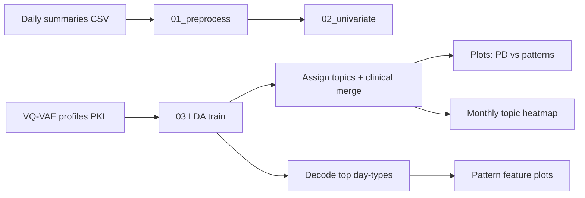

# Remote monitoring of behavioral–physiologic trajectories predict progression and reflect biologic host state in metastatic cancer in women

This repository contains the code, analysis-ready data, and workflows used in the study on remote monitoring of behavioral and physiologic trajectories in patients with metastatic cancer.

## Authors

<sup>\*</sup> LP and LG contributed equally to this manuscript.

Leire Paz<sup>1,\*</sup>, Leonardo Garma<sup>2,\*</sup>, Sonia Pernas<sup>3,4</sup>, Juan Antonio Guerra<sup>5</sup>, Rosario García-Campelo<sup>6</sup>, Jacobo Rogado<sup>7</sup>, David Vicente-Baz<sup>8</sup>, Josefa Terrasa<sup>9</sup>, Begoña Bermejo<sup>10</sup>, Ruth Vera<sup>11</sup>, Santiago González Santiago<sup>12</sup>, Sandra Gallach<sup>13,14,15</sup>, Berta Nasarre<sup>5</sup>, Bartomeu Fullana<sup>3</sup>, Desirée Jiménez<sup>2</sup>, Cristina Reboredo-Rendo<sup>6</sup>, Oscar Padilla<sup>3</sup>, Rodrigo Oliver<sup>1</sup>, Cristina Simarro<sup>8</sup>, Antonia Perelló<sup>9</sup>, Berta Hernández-Martín<sup>10</sup>, Aída Morillas<sup>2</sup>, Silvana Mourón<sup>2</sup>, María J. Bueno<sup>2</sup>, Antonio Lopez<sup>2</sup>, Pablo Martínez Olmos<sup>1</sup>, Silvia Calabuig<sup>13,14,15</sup>, Ramon Colomer<sup>7,16</sup>, Antonio Artes<sup>1</sup>, Miguel Quintela-Fandino<sup>2,7</sup>

## Affiliations

1. Communications and Signal Theory, Escuela Politécnica Superior, Universidad Carlos III, Leganés (Madrid), Spain
2. Breast Cancer Clinical Research Unit, CNIO – Spanish National Cancer Research Center, Madrid, Spain
3. Breast Cancer Unit, Department of Medical Oncology, Institut Català d’Oncologia, L’Hospitalet de Llobregat (Barcelona), Spain
4. Institut d’Investigació Biomèdica de Bellvitge (IDIBELL), L’Hospitalet de Llobregat (Barcelona), Spain
5. Medical Oncology, Hospital Universitario de Fuenlabrada, Fuenlabrada (Madrid), Spain
6. Medical Oncology, Complejo Hospitalario Universitario de A Coruña – CHUAC, A Coruña, Spain
7. Medical Oncology, Hospital Universitario de La Princesa, Madrid, Spain
8. Medical Oncology, Hospital Universitario Virgen de la Macarena, Sevilla, Spain
9. Medical Oncology, Hospital Universitari Son Espases, Palma, Spain
10. Medical Oncology, Hospital Clínico Universitario, Valencia, Spain
11. Medical Oncology, Hospital Universitario de Navarra, Navarra, Spain
12. Medical Oncology, Hospital San Pedro de Alcántara – Complejo Hospitalario Universitario de Cáceres, Cáceres, Spain
13. Department of Pathology, Universitat de València, Valencia, Spain
14. Centro de Investigación Biomédica en Red Cáncer (CIBERONC), Madrid, Spain
15. Molecular Oncology Laboratory, Fundación Investigación Hospital General Universitario de Valencia, Valencia, Spain
16. Roche Endowed Chair of Precision and Personalized Medicine, Universidad Autónoma de Madrid, Madrid, Spain

## Repository structure

```
.
├── data/                 # Processed, anonymized data
│   ├── processed/        # Analysis-ready tables
│   │   ├── behavioral/   # Behavioral trajectories (activity, sleep, etc.)
│   │   ├── physiologic/  # Physiologic trajectories (HR, HRV, etc.)
│   │   └── clinical/     # Outcomes and clinical variables
│   └── metadata/         # Variable dictionaries, cohort definitions, code maps
├── scripts/              # Processing, analysis, and modeling code
│   ├── utils/            # Shared code across methods
│   ├── 01_preprocess/    # Per method: lda/, vq-vae/
│   ├── 02_univariate_analysis/
│   ├── 03_analysis/
│   └── 04_figures/
└── results/              # Reproducible outputs (not raw data)
    ├── lda/              # figures/, tables/, models/
    └── vq-vae/
```

See `data/README.md`, `scripts/README.md`, and `results/README.md` for folder-level detail.

---

## Guía de análisis (reproducir figuras y tablas)

Esta sección resume **cómo preparar el entorno**, **qué hace el LDA en el estudio** y **qué comando genera cada figura o tabla**. El código proviene de los notebooks (`1_2`, `4_01`, `5`, `6_1`) refactorizado en `scripts/`.

### Idea general del flujo

El monitorizado remoto genera **resúmenes diarios** (Garmin / móvil). Un **VQ-VAE** asigna a cada día un **perfil discretizado** (ID de day-type). El **LDA** (Latent Dirichlet Allocation) agrupa esos perfiles en **6 patrones conductuales** recurrentes (“topics” / “patterns”) a lo largo de la serie temporal de cada paciente. Después se cruza con **progresión (PD)**, se **decodifican** los day-types a variables interpretables y se dibuja el **heatmap mensual** de patrón predominante.



| Etapa | Carpeta | Qué responde |
|-------|---------|--------------|
| **01** | `scripts/01_preprocess/lda/` | ¿Están limpios y homogéneos los daily summaries? |
| **02** | `scripts/02_univariate_analysis/lda/` | ¿Las variables crudas difieren entre E.PD y no-E.PD en ventanas fijas? |
| **03** | `scripts/03_analysis/lda/` | ¿Cuáles son los 6 patrones LDA, quién los muestra y cómo se relacionan con PD? |

### Preparación del entorno

Los datos y el entorno virtual **no** están en git (ver `.gitignore`). En el servidor de análisis, crea y activa un venv local (recomendado Python 3.10):

```bash
cd /path/to/cancer-behavioral-trajectories

# Example: venv with Python 3.10
python3.10 -m venv env
source env/bin/activate

pip install pandas numpy matplotlib seaborn scipy gensim openpyxl
```

Activa el entorno antes de cada comando: `source env/bin/activate`.

**Datos externos** (ficheros grandes en rutas CNIO): si no están bajo `data/`, los scripts usan por defecto `/export/gts_usuarios/lparbaiza/cnio/` (Excel clínico, embeddings decodificados, tabla mensual de topics, modelo LDA de 100k passes del notebook 6_1). Copia lo que necesites a `data/raw/` o `data/processed/` para trabajar sin depender de CNIO.

### LDA en este proyecto (intuición)

1. **Entrada:** Por paciente, lista ordenada de **IDs de day-type** (`embedding_ids` en el CSV de topics, o perfiles del PKL del VQ-VAE).
2. **Documentos:** El LDA agrupa **30 días consecutivos** en un “documento” (ventanas deslizantes / meses en pasos posteriores).
3. **Modelo:** LDA de `gensim` con **6 topics** aprende qué day-types co-ocurren en cada patrón.
4. **Salida por paciente:** Probabilidades por topic, **patrón predominante** y, para figuras, **top-10 day-types** por patrón.

El entrenamiento con todos los passes (`--passes 10000`) es lento; usa `--skip-train` si ya existe `data/processed/lda/lda_model_6topics.gensim`.

### Paso a paso: comandos y salidas

Ejecuta desde la raíz del repositorio con `env` activado.

#### 1 — Preprocesado de daily summaries

Limpia un export crudo (sentinelas de FC, `sleep_start` inválidos).

```bash
python scripts/01_preprocess/lda/preprocess_daily_summaries.py
```

| Salida | Ruta |
|--------|------|
| Daily summary filtrado | `data/raw/daily_summary_eb2prod_dic25_enriched_filtered.csv` |

#### 2 — Análisis univariado (E.PD vs no-E.PD)

Requiere el daily summary filtrado y la tabla de matching `PD_noPD_Matching_fechas_finales_dic25.csv` (`data/raw/` o CNIO).

```bash
python scripts/02_univariate_analysis/lda/run_univariate_analysis.py
```

| Salida | Ruta |
|--------|------|
| Comparación de densidades | `results/univariate/figures/univariate_matched_dens_2dates.png` |
| Histogramas | `results/univariate/figures/univariate_matched_hist_absolute_2dates.png` |
| Tabla resumen de variables | `results/univariate/tables/variable_summary_full_stats_EPD.csv` |
| Cohortes exportadas | `data/processed/lda/df_15_primeros_EB2_prog.csv`, `df_15_previos_HDM_prog.csv` |

#### 3a — LDA: entrenar, asignar topics, merge clínico, figuras PD

Requiere `data/processed/vq-vae/profiles_per_sample_oncology_28_12_2025.pkl` y el Excel clínico (CNIO o `data/raw/`).

```bash
# Ejecución completa (el entrenamiento puede tardar horas con passes por defecto)
python scripts/03_analysis/lda/run_lda_pipeline.py

# Si ya existen modelo y diccionario en data/processed/lda/
python scripts/03_analysis/lda/run_lda_pipeline.py --skip-train
```

| Salida | Ruta |
|--------|------|
| Modelo y diccionario LDA | `data/processed/lda/lda_model_6topics.gensim`, `dictionary_lda_180patients.dict` |
| Asignación de topics por usuario | `data/processed/lda/user_topic_cluster_6topics_lda.csv` |
| Top-10 day-types por patrón | `results/lda/tables/lda_topics_top10.csv` |
| Grid de términos top | `results/lda/figures/lda_top_terms_grid.png` |
| Topic predominante según evento PD | `results/lda/figures/topics_by_event.png` |
| Distribución media de topics PD vs no-PD | `results/lda/figures/avg_topic_distribution_by_event.png` |
| Merge topics + clínica | `data/processed/lda/merged_topics_clinical.csv` |

#### 3b — Decodificar day-types → variables conductuales

Une cada day-type del top-10 con el vector **decodificado** del VQ-VAE (sueño, pasos, localización, etc.).

```bash
python scripts/03_analysis/lda/run_decode_profiles.py
```

| Salida | Ruta |
|--------|------|
| Features decodificadas (raw / z-score) | `data/processed/lda/decoded_profiles_top10.csv`, `decoded_profiles_top10_scaled.csv` |
| Grid principal de patrones (manuscrito) | `results/lda/figures/decoded_topic_plots/final_pattern_analysis_grid.svg` |
| Paneles patrones 0 y 3 | `results/lda/figures/decoded_topic_plots/pattern_0_individual.svg`, `pattern_3_individual.svg` |
| Boxplot opcional | `results/lda/figures/behavioral_features_by_pattern_boxplot.svg` |

#### 3c — Heatmap de patrón predominante por mes

Una fila por paciente, una columna por mes; el recuadro negro marca el mes de progresión en casos PD.

```bash
python scripts/03_analysis/lda/run_monthly_topics_heatmap.py
```

Por defecto lee `PD_cutoff_dic_2025s_eB2_MonthPredom.csv` en CNIO. Para reconstruir esa tabla desde embeddings diarios:

```bash
python scripts/03_analysis/lda/run_monthly_topics_heatmap.py --rebuild-table
```

| Salida | Ruta |
|--------|------|
| Heatmap PNG / SVG | `results/lda/figures/predominant_topics_per_month.png`, `.svg` |
| Tabla mensual (si se reconstruye) | `data/processed/lda/monthly_predominant_topics.csv` |

### Orden recomendado (rama LDA)

```text
source env/bin/activate

python scripts/01_preprocess/lda/preprocess_daily_summaries.py
python scripts/02_univariate_analysis/lda/run_univariate_analysis.py
python scripts/03_analysis/lda/run_lda_pipeline.py          # add --skip-train if model exists
python scripts/03_analysis/lda/run_decode_profiles.py
python scripts/03_analysis/lda/run_monthly_topics_heatmap.py
```

Las **figuras** para el manuscrito van a `results/lda/figures/` y `results/univariate/figures/`; las **tablas** a `results/lda/tables/` y `results/univariate/tables/`. Modelos y CSV intermedios por paciente quedan en `data/processed/lda/` (gitignored).

Opciones y rutas por script: [`scripts/README.md`](scripts/README.md).

---

## Data and privacy

Raw patient data are not published. Only **processed, anonymized** datasets that comply with applicable regulations and informed consent are included in this repository. Raw data remain outside version control (see `.gitignore`).

## License

Code is under the [Apache License 2.0](LICENSE). Data may have additional use conditions; see `data/README.md`.

## Citation

If you use this material, please cite the manuscript (bibliographic reference pending publication).
