# Rolling-burden alarm and temporal granularity

## 1. What the alarm is

The alarm is a **prospective rolling-burden** rule on behavioural topic probabilities from LDA / DCABP.

At each decision time \(t\):

1. Build **pUF** = P(topic 3) + P(topic 4) + P(topic 5) (unfavourable day-types).
2. Aggregate pUF over a **lookback window W** into a **burden** score.
3. Raise an alarm if burden ≥ threshold \(\theta\).
4. Label the decision as positive if progression (PD) occurs within a future **horizon H** after \(t\).

Only decisions with enough history (full W) and enough follow-up to score the label (or a known PD time) are kept. Those eligible \((patient, t)\) pairs are the **decision points**.

---

## 2. Parameters that can be varied

| Parameter | Role | Typical choices |
|-----------|------|-----------------|
| **W (lookback)** | How much past burden is summarised at \(t\) | 60 / 90 / 120 days (≈ 2 / 3 / 4 months) |
| **H (horizon)** | How far ahead PD counts as a hit | 90 / 120 / 180 days (≈ 3 / 4 / 6 months) |
| **Granularity** | How often decisions are made and how LDA is built | daily, weekly, biweekly, monthly |
| **Score family** | How pUF / burden are constructed | **sampled** vs **collapsed** (below) |
| **θ (threshold)** | Alarm cutoff on the burden scale | Youden-optimal, or a fixed operating point (e.g. ~1.61 on monthly *sum* scale) |
| **Event / censor time** | Clock used to stop landmarks and label PD | clinical follow-up days (`Obs_time`) or eB2-aligned event time |

### Sampled vs collapsed

| Family | Idea |
|--------|------|
| **Sampled** | Daily sliding LDA (30-day window) → daily pUF; weekly / biweekly / monthly only change *when* you decide (same underlying daily signal). Burden = rolling mean over the last **W days**. |
| **Collapsed** | One LDA per non-overlapping block (7 / 14 / 30 d) → block pUF; burden = rolling mean over the last `round(W/block)` blocks. |

Collapsed block pUF is **not** the mean of daily pUF inside the block: each family is its own LDA construction.

### Monthly collapsed landmarks

On the monthly scale, month \(m\) is placed at day \(t = m \times 30\). A landmark is kept only if \(t\) is strictly before the event/censor time. Burden is the **sum** of pUF over the last W months (so thresholds are on a sum scale, ~1.61, not the mean scale ~0.5 used elsewhere).

---

## 3. Experiment in this report

We fix a main operating region and then sweep the knobs above:

1. **Monthly collapsed baseline** — W = 3 months, H = 4 months, clinical `Obs_time` as event/censor clock, Youden / fixed θ ≈ 1.61.  
2. **Granularity comparison** — W = 90 d, H = 120 d; sampled (daily→monthly) vs collapsed (weekly / biweekly / monthly).  
3. **W × H grid** — W ∈ {60, 90, 120} d × H ∈ {90, 120, 180} d.  
4. **Individual trajectories** — example patients with and without PD.

Outputs live under `results/alarm/` (`tables/`, `figures/`, `analysis_figures/`, `analysis_outputs/`). Primary monthly landmarks: `tables/decision_points_W3_H4.csv` (**Obs_time**, n=1015).

**Delivery summary figures** (high-res, Obs_time-aligned, AUROC with patient-bootstrap CIs): [`analysis_figures/`](analysis_figures/).

---

## 4. Results — monthly collapsed baseline (W = 3 mo, H = 4 mo)

Score = **sum** of pUF over W months; cutoff: `month × 30 < Obs_time`.

| Metric | Value |
|--------|-------|
| ROC-AUC | **0.704** |
| Sens / Spec (θ≈1.61, sum scale) | 0.704 / 0.626 |
| PPV / NPV | 0.259 / 0.919 |
| TP / FN / FP / TN | 112 / 47 / 320 / 536 |

**Threshold scale (same rule, two writings):**

| Scale | θ | Relation |
|-------|---:|----------|
| Sum (as used here) | **1.61** | `sum` of last W=3 monthly pUF |
| Mean (equivalent) | **≈ 0.537** | `1.61 / 3` |

Youden exact: 1.610762 (sum) ↔ **0.536921** (mean). AUC is identical under either writing; only the threshold number changes. The mean form (~0.54) is on the same ~0–1 scale as sampled / other collapsed configs.

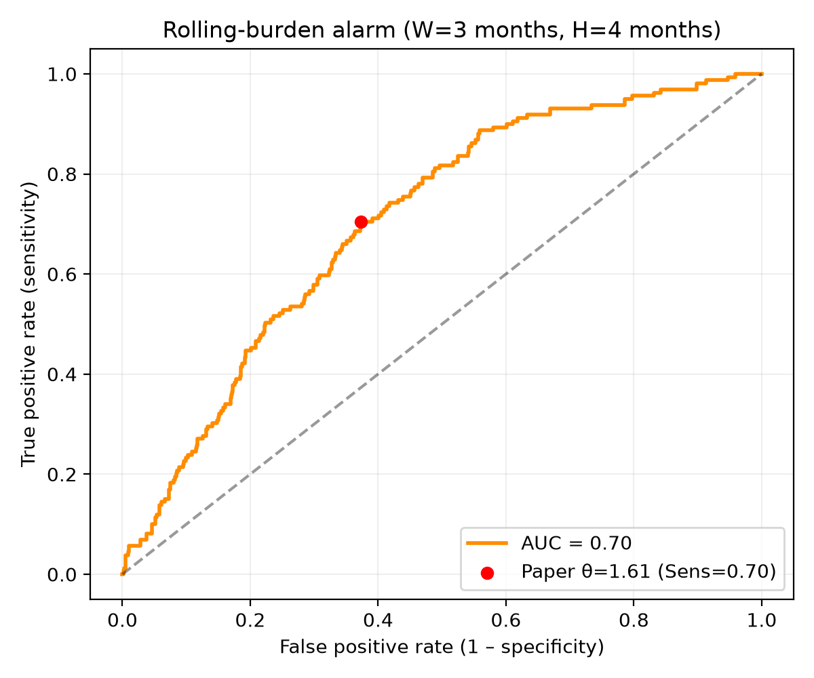

---

## 5. Results — granularity (W = 90 d, H = 120 d)

Operating point = Youden threshold per row.  
Sampled and non-monthly collapsed use a **mean** burden (~0.4–0.6). Monthly collapsed is reported on the **sum** scale (~1.61); mean-equivalent θ ≈ **0.537** (see §4).

**Clinical clock:** all rows below use the same follow-up field as the monthly baseline — **`Obs_time`** (sampled/collapsed pUF aligned to `Subjects_data.Obs_time` before scoring).  
**AUROC uncertainty:** 95% CIs from **patient-clustered bootstrap** (resample patients with replacement; 2000 reps). See `analysis_figures/auc_ci_W90_H120.csv`.

| Granularity | n | AUC | 95% CI | Sens | Spec | PPV | NPV |
|-------------|--:|----:|--------|-----:|-----:|----:|----:|
| daily (sampled) | 36316 | 0.684 | 0.611–0.751 | 0.643 | 0.646 | 0.240 | 0.912 |
| weekly sampled | 5235 | 0.683 | 0.610–0.750 | 0.645 | 0.646 | 0.239 | 0.913 |
| biweekly sampled | 2651 | 0.680 | 0.607–0.746 | 0.674 | 0.613 | 0.230 | 0.917 |
| monthly sampled | 1278 | 0.682 | 0.610–0.747 | 0.827 | 0.475 | 0.210 | 0.942 |
| weekly collapsed | 4127 | 0.707 | 0.625–0.780 | 0.753 | 0.590 | 0.251 | 0.929 |
| biweekly collapsed | 2125 | 0.695 | 0.614–0.767 | 0.713 | 0.601 | 0.259 | 0.914 |
| monthly collapsed (30 d) | **1015** | **0.704** | 0.632–0.777 | 0.704 | 0.626 | 0.259 | 0.919 |

**Short read**

- **Sampled** (daily→monthly): AUC nearly flat (~0.68). Subsampling does not improve discrimination; it only reduces n.
- **Collapsed** improves somewhat vs sampled (~0.70–0.71). Highest point estimate here: **weekly collapsed (AUC 0.707)**; CIs overlap across collapsed configs.
- PPV remains low (~0.21–0.26); NPV high (~0.91–0.94).
- Do not compare monthly θ≈1.61 to sampled θ≈0.55 without converting: use **θ_mean = θ_sum / W**.

High-resolution delivery panel (metrics table + AUROC points with 95% CI + ROC; no winner star):

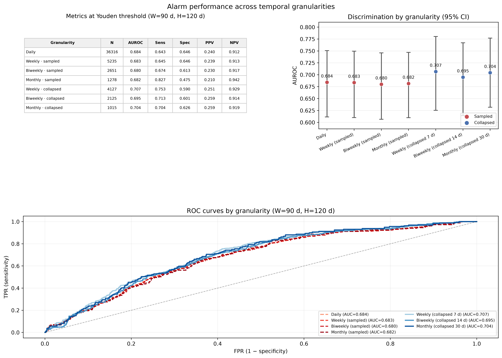

Pipeline figures (same setting; older layout):

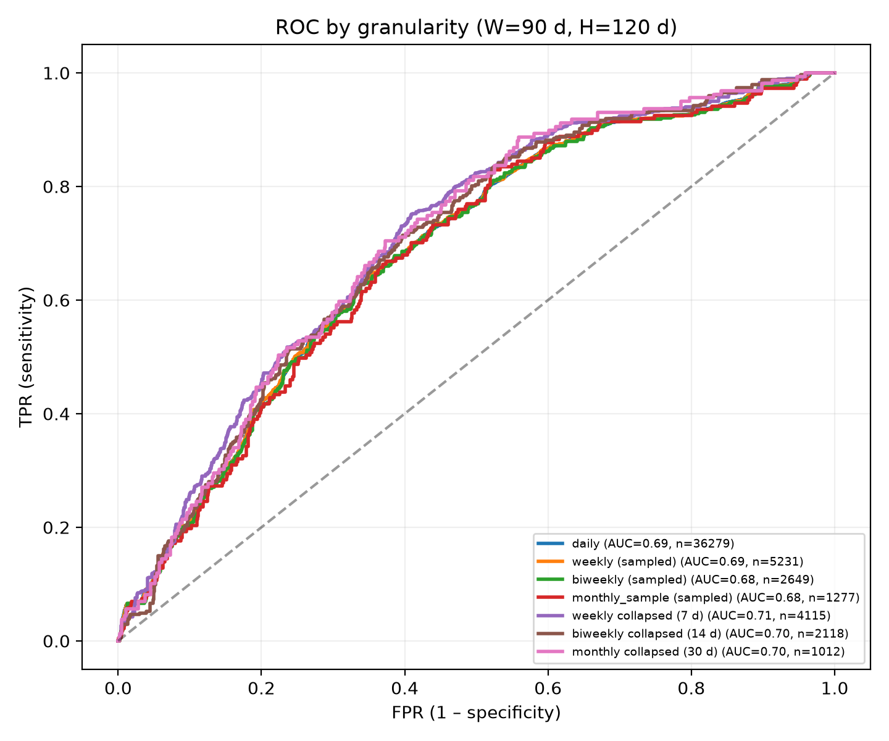

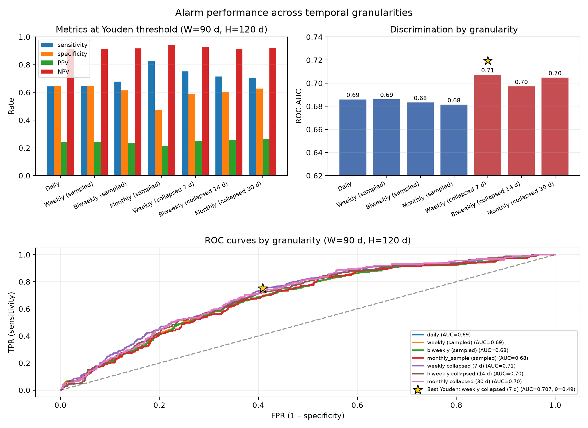

---

## 6. Results — W × H grid

Grid: **W ∈ {60, 90, 120} d** × **H ∈ {90, 120, 180} d**.

### AUC (selected)

| | H=90 | H=120 | H=180 |
|--|-----:|------:|------:|
| **Daily** W=60/90/120 | 0.662 / 0.672 / 0.681 | 0.675 / 0.686 / 0.694 | 0.706 / 0.713 / 0.716 |
| **Weekly collapsed ★** | 0.673 / 0.697 / 0.709 | 0.688 / **0.707** / 0.719 | 0.717 / 0.732 / **0.740** |
| **Monthly collapsed** | 0.675 / 0.692 / 0.702 | 0.683 / 0.704 / 0.715 | 0.713 / 0.730 / 0.737 |

**Read**

- **↑H** → AUC rises monotonically.
- **↑W** → AUC rises moderately (more historical load).
- Ranking **collapsed ≳ sampled** holds across almost the whole grid.
- W≈90 / H≈120 sits in the mid region of the map.

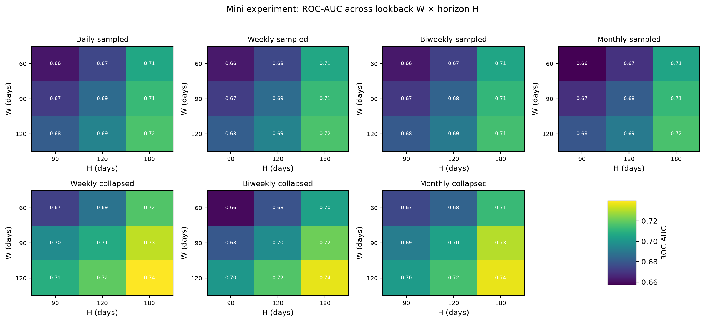

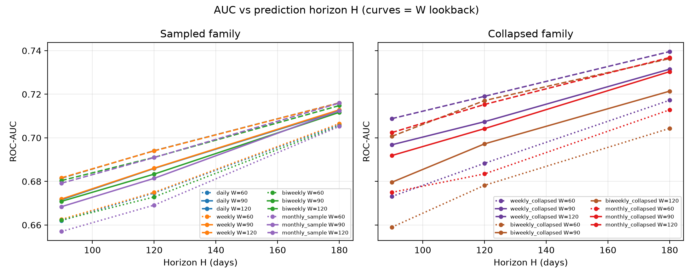

Table: `tables/wh_grid_auc.csv`

---

## 7. Results — individual trajectories

Patients: **62004**, **23003**, **31002**, **41006**.

| ID | Profile | Notes |
|----|---------|-------|
| 62004 | PD (day 317) | 1st alarm ~month 7 (lead before PD) |
| 23003 | PD (day 206) | High burden from the start; early alarm |
| 31002 | No PD | Late alarm (~month 21) with no event in follow-up |
| 41006 | No PD | Below threshold; no alarm |

### 7.1 Monthly collapsed (pUF + rolling burden)

W=3 months, H=4 months, θ=1.61 (mean-scale θ/W≈0.54).

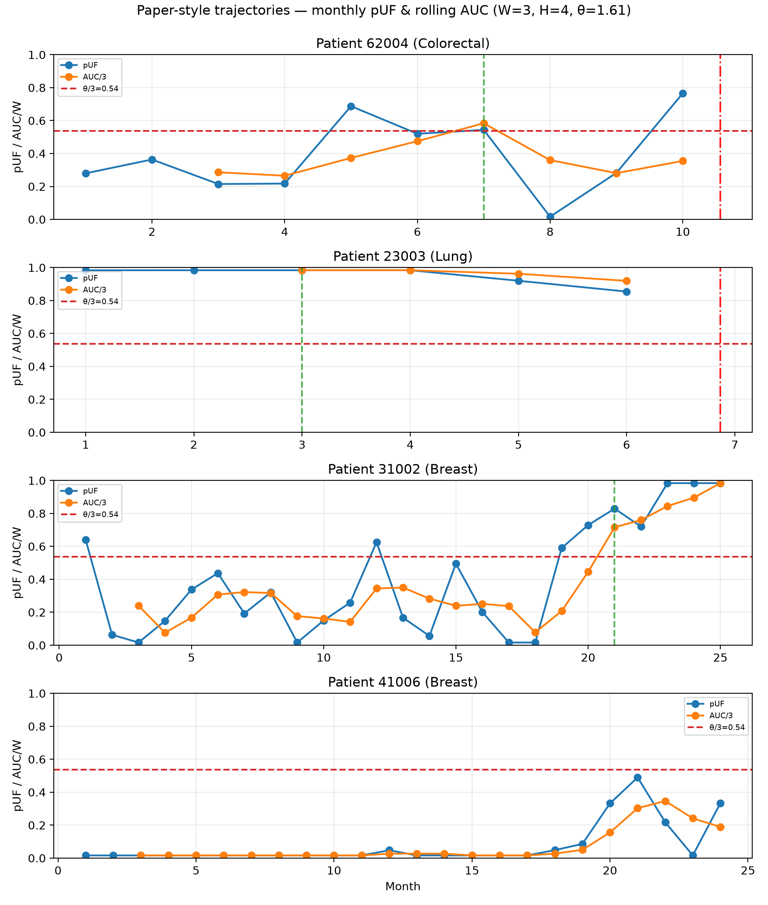

### 7.2 Sampled vs collapsed (W = 90 d)

Simplified high-res delivery plots (daily/sampled burden vs monthly collapsed; Obs_time clock; construction-specific Youden θ labelled):

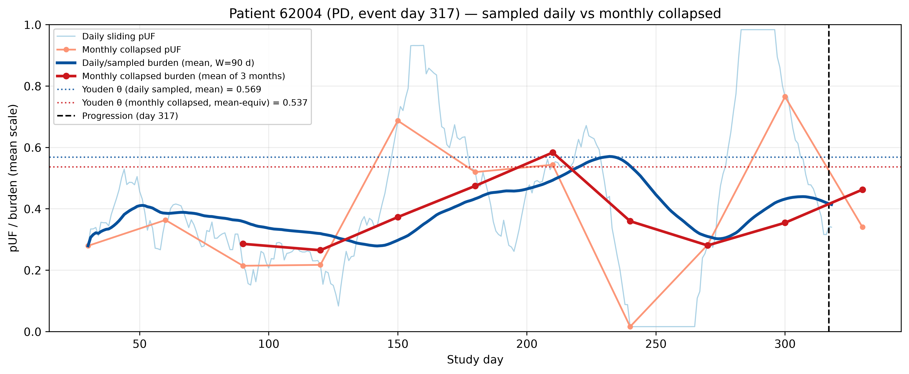

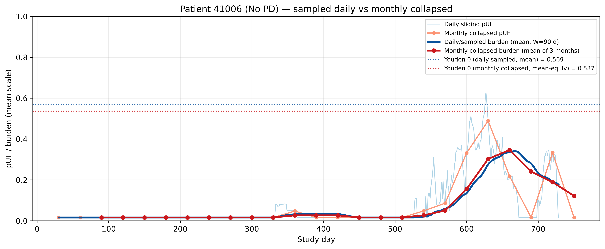

Full multi-panel trajectories:

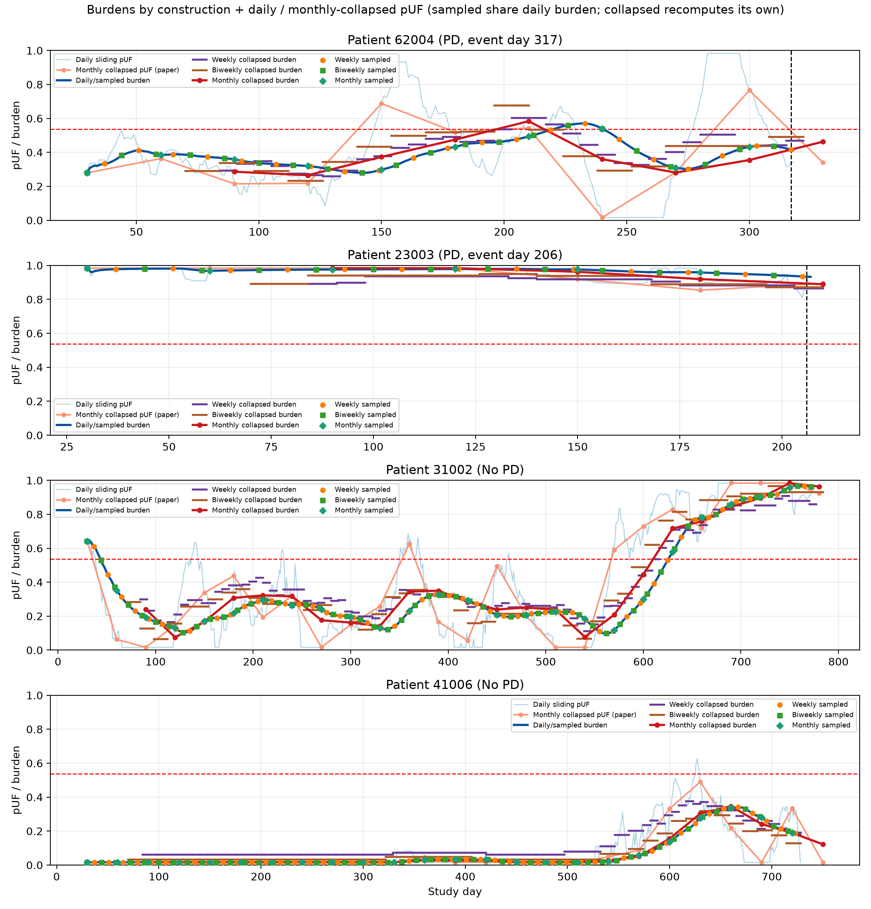

- **Blues:** daily sliding pUF + daily/sampled burden  
- **Reds:** monthly collapsed pUF + monthly collapsed burden  
- Steps: weekly / biweekly collapsed burden  
- Markers: sampled evaluation (7 / 14 / 30 d) on the daily burden  

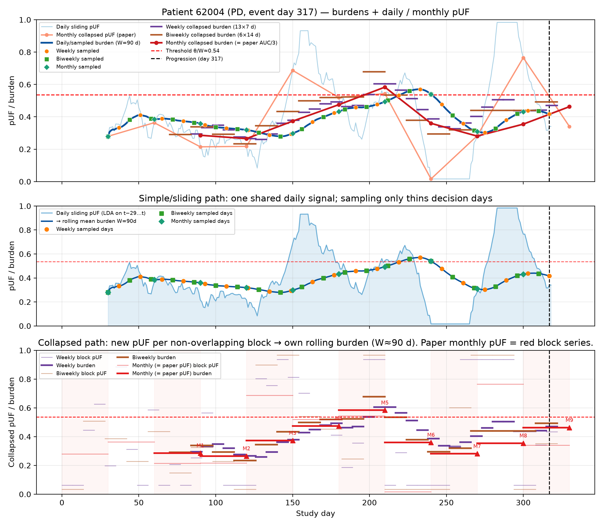

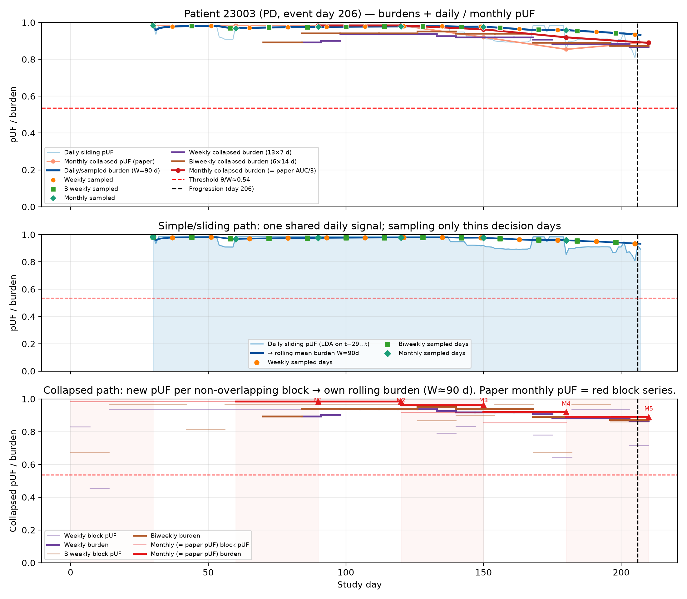

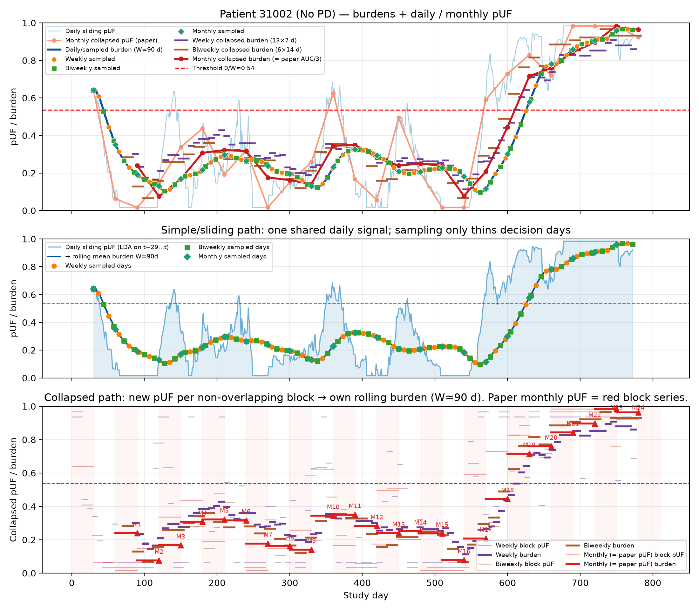

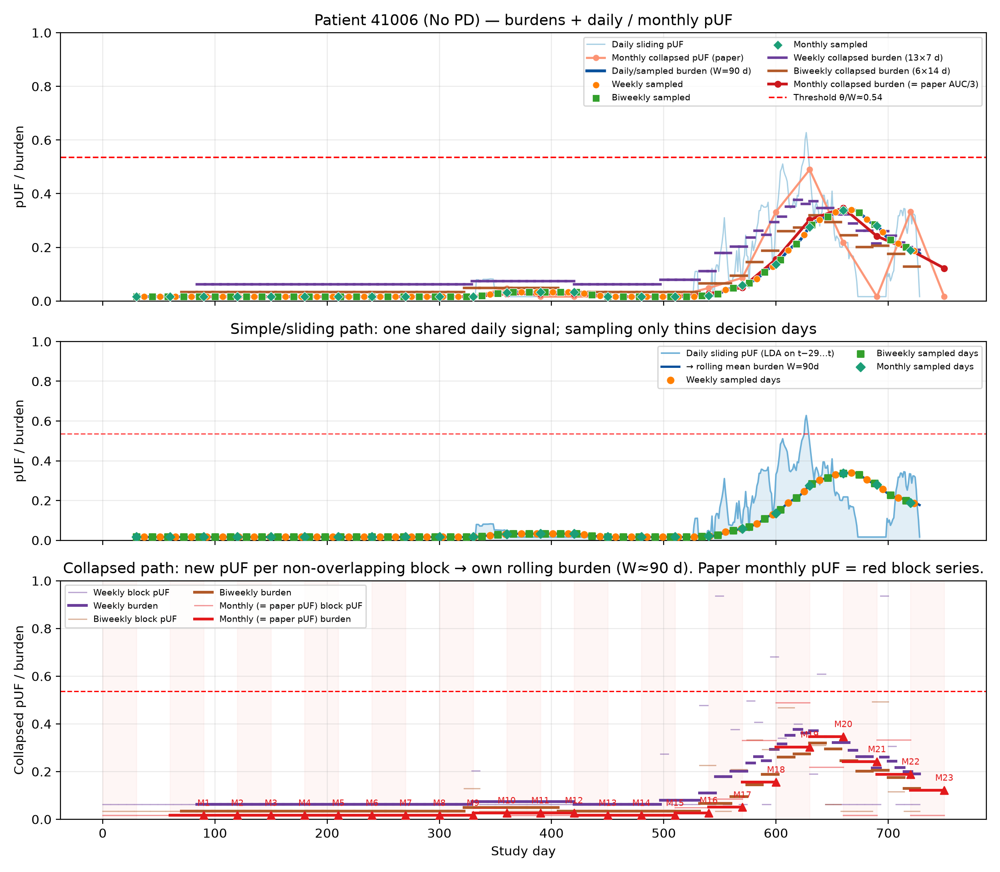

---

## 8. How to reproduce

```bash
# Monthly baseline + ROC sweep
.venv/bin/python scripts/03_analysis/alarm/run_granularity_sweep.py --monthly-only
.venv/bin/python scripts/03_analysis/alarm/run_granularity_sweep.py --skip-lda

# W×H mini-experiment (+ heatmaps)
.venv/bin/python scripts/03_analysis/alarm/analyze_missingness_and_wh_grid.py

# Monthly trajectories
.venv/bin/python scripts/03_analysis/alarm/plot_patient_trajectories.py \
  --patients 62004,23003,31002,41006

# Sampled vs collapsed trajectories
.venv/bin/python scripts/03_analysis/alarm/plot_granularity_trajectories.py \
  --patients 62004,23003,31002,41006 --W 90

# High-res delivery figures (Obs_time-aligned; AUROC patient-bootstrap CIs)
.venv/bin/python scripts/03_analysis/alarm/plot_analysis_figures.py
```

File map: [`README.md`](README.md). Delivery panel: [`analysis_figures/`](analysis_figures/).

---

## 9. Conclusions

1. **Subsampling** the same daily signal (sampled) **does not improve** discrimination: AUC stays ~**0.68** from daily→monthly.  
2. **Collapsing** LDA into non-overlapping blocks (7/14/30 d) **does improve** somewhat: AUC ~**0.70–0.71** at W=90 d, H=120 d.  
3. The **highest point estimate** in that setting is **weekly collapsed** (AUC **0.707**; Youden Sens/Spec ≈ 0.75/0.59); patient-bootstrap 95% CIs overlap across collapsed configs.  
4. **↑W** and **↑H** raise AUC in an ordered way; ranking collapsed ≳ sampled holds on the grid.  
5. **PPV** stays low (~**0.25**): the alarm discriminates but yields many false positives at useful thresholds.  
6. Individually, the score can anticipate PD (lead time), mark persistently high burden, or fire late alarms with no event — useful for interpretation beyond aggregate metrics.  
7. The delivery summary figure uses the **same clinical follow-up field (`Obs_time`)** for all granularities as the monthly baseline (n=1015), with **AUROC 95% CIs from patient-level bootstrap**.
