# Alarma de burden y granularidad temporal

**Fecha:** 2026-09-07  
**Setting principal:** W = 90 d, H = 120 d (también barrido W×H)

---

## 1. Pregunta

¿Cómo depende el rendimiento de la alarma prospectiva de *rolling burden* de la **granularidad temporal** y de la forma de construir el score?

Se comparan dos familias:

1. **Sampled** — pUF diario (LDA deslizante 30 d); weekly / biweekly / monthly solo cambian el calendario de decisión.  
2. **Collapsed** — un LDA por bloque no solapado (7 / 14 / 30 d) y burden propio sobre esos periodos.

Además: trayectorias individuales y barrido de lookback (W) × horizonte (H).

---

## 2. Definiciones

| Concepto | Definición |
|----------|------------|
| **pUF** | Suma de probabilidades LDA de topics desfavorables **3+4+5** |
| **Daily / sliding pUF** | Cada día `d ≥ 30`: LDA sobre la ventana `[d−29, d]` |
| **Collapsed pUF** | Un LDA por bloque no solapado (7 / 14 / 30 d) |
| **Burden (sampled)** | Media móvil de los últimos **W días** del pUF diario |
| **Burden (collapsed)** | Media móvil de los últimos `round(W/block)` periodos de pUF collapsed |
| **W (lookback)** | Cuánto hacia atrás se acumula el burden antes de la decisión |
| **H (horizon)** | Ventana futura en la que se etiqueta progresión (PD) |

**Nota metodológica:** sampled y collapsed son construcciones LDA distintas; el pUF collapsed de un bloque **no** es la media del pUF diario dentro de ese bloque. Cada serie collapsed calcula su propio burden.

---

## 3. Baseline mensual collapsed (W = 3 mes, H = 4 mes)

Referencia en escala mensual (score = suma de pUF en W meses; θ Youden ≈ 1.61).

| Métrica | Valor |
|---------|-------|
| Decision points | 1012 (159 positivos) |
| ROC-AUC | **0.705** |
| Sens / Spec | 0.704 / 0.627 |
| PPV / NPV | 0.260 / 0.919 |
| TP / FN / FP / TN | 112 / 47 / 318 / 535 |

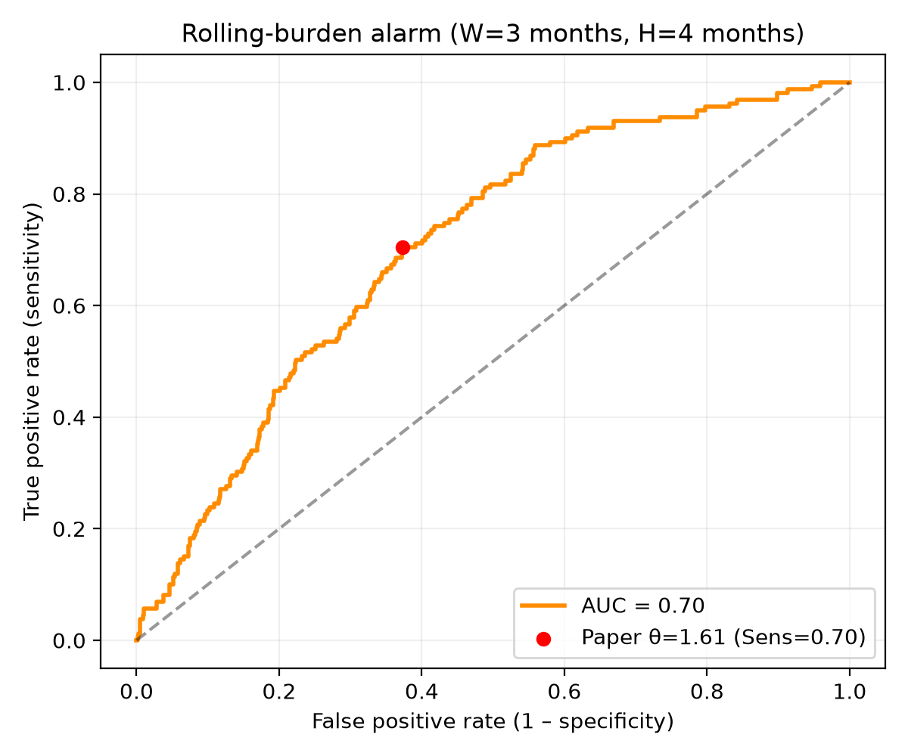

---

## 4. Comparación de granularidades (W = 90 d, H = 120 d)

Punto de operación = umbral de Youden en cada fila.  
*Nota:* en `monthly_collapsed` el umbral Youden (~1.61) está en escala **suma**; el resto en escala **media** (~0.5).

| Granularidad | n | AUC | Sens | Spec | PPV | NPV |
|--------------|--:|----:|-----:|-----:|----:|----:|
| daily (sampled) | 36279 | 0.686 | 0.644 | 0.647 | 0.243 | 0.912 |
| weekly sampled | 5231 | 0.686 | 0.648 | 0.647 | 0.243 | 0.913 |
| biweekly sampled | 2649 | 0.683 | 0.678 | 0.614 | 0.233 | 0.917 |
| monthly sampled | 1277 | 0.681 | 0.829 | 0.476 | 0.213 | 0.942 |
| **weekly collapsed ★** | 4115 | **0.707** | 0.751 | 0.591 | 0.251 | 0.929 |
| biweekly collapsed | 2118 | 0.697 | 0.714 | 0.603 | 0.260 | 0.915 |
| monthly collapsed (30 d) | 1012 | 0.705 | 0.704 | 0.627 | 0.260 | 0.919 |

### Lectura rápida

- **Sampled** (daily→monthly): AUC casi plano (~0.68). Submuestrear no gana discriminación; solo reduce n.
- **Collapsed** mejora algo respecto a sampled (~0.70–0.71). Mejor punto: **weekly collapsed (AUC 0.707)** ★.
- PPV sigue bajo (~0.21–0.26); NPV alto (~0.91–0.94).

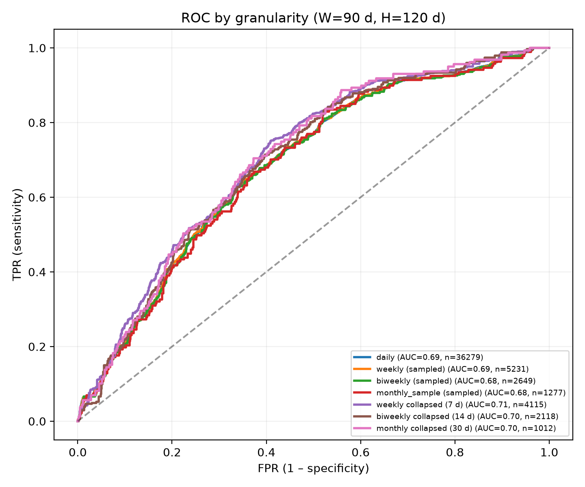

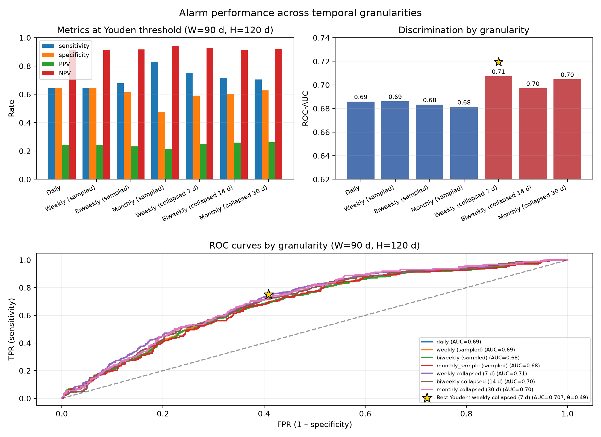

---

## 5. Mini-experimento variando W y H

Grid: **W ∈ {60, 90, 120} d** × **H ∈ {90, 120, 180} d**.

### AUC (selección)

| | H=90 | H=120 | H=180 |
|--|-----:|------:|------:|
| **Daily** W=60/90/120 | 0.662 / 0.672 / 0.681 | 0.675 / 0.686 / 0.694 | 0.706 / 0.713 / 0.716 |
| **Weekly collapsed ★** | 0.673 / 0.697 / 0.709 | 0.688 / **0.707** / 0.719 | 0.717 / 0.732 / **0.740** |
| **Monthly collapsed** | 0.668 / 0.688 / 0.703 | 0.681 / 0.705 / 0.717 | 0.713 / 0.731 / 0.738 |

### Lectura

- **↑H** → AUC sube de forma monótona.
- **↑W** → AUC sube de forma moderada (más carga histórica).
- El orden **collapsed ≳ sampled** se mantiene en casi todo el grid.
- W≈90 / H≈120 queda en la zona media del mapa (ni mínimo ni máximo del grid).

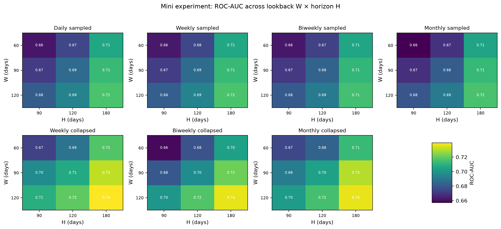

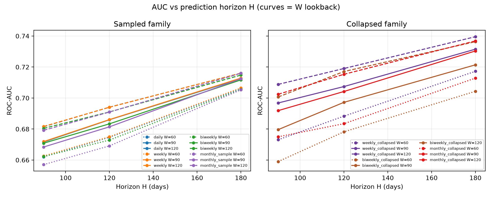

Tabla: `tables/wh_grid_auc.csv`

---

## 6. Trayectorias individuales

Pacientes: **62004**, **23003**, **31002**, **41006**.

| ID | Perfil | Notas |
|----|--------|-------|
| 62004 | PD (día 317) | 1ª alarma ~mes 7 (lead antes de PD) |
| 23003 | PD (día 206) | Burden alto desde el inicio; alarma temprana |
| 31002 | No PD | Alarma tardía (~mes 21) sin evento en follow-up |
| 41006 | No PD | Bajo umbral; sin alarma |

### 6.1 Mensual collapsed (pUF + rolling burden)

W=3 meses, H=4 meses, θ=1.61 (escala media θ/W≈0.54).

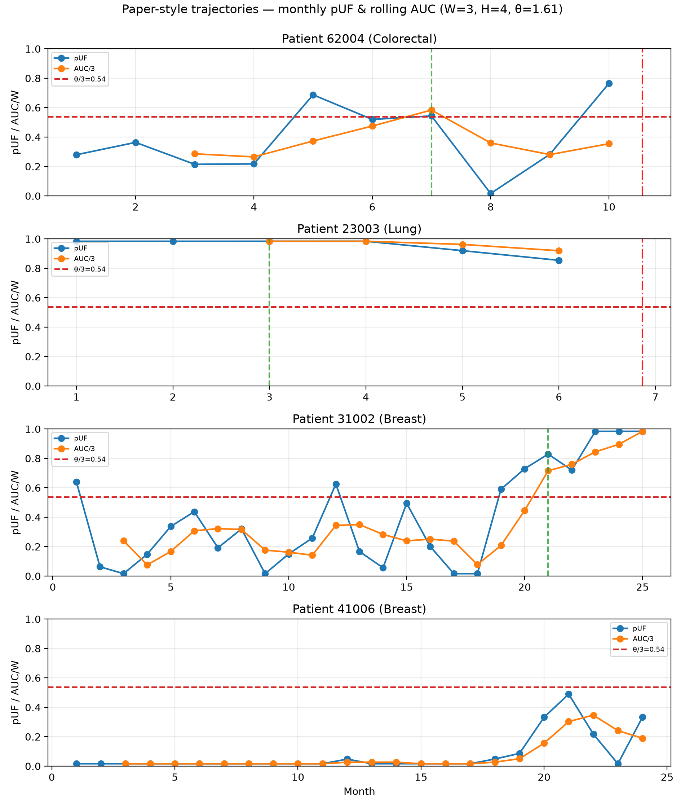

### 6.2 Sampled vs collapsed (W = 90 d)

Burdens por construcción + daily pUF y monthly collapsed pUF.

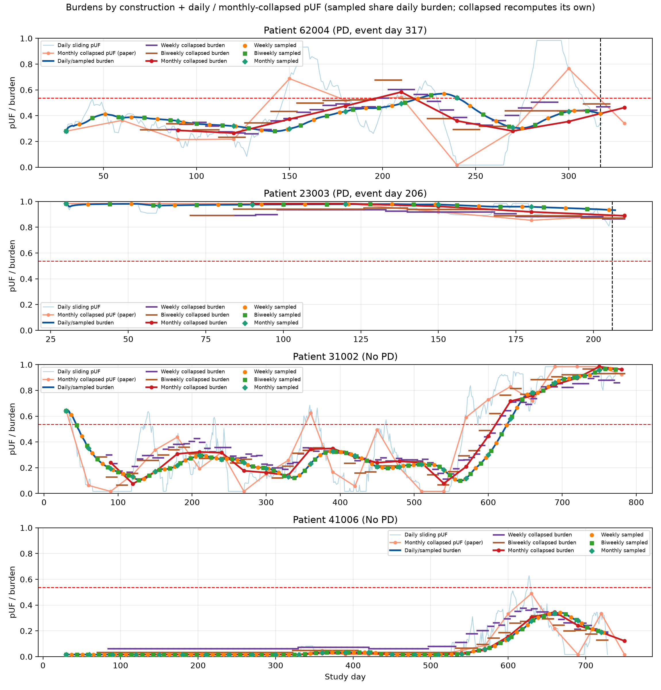

- **Azules:** daily sliding pUF + daily/sampled burden  
- **Rojos:** monthly collapsed pUF + monthly collapsed burden  
- Steps: weekly / biweekly collapsed burden  
- Markers: evaluación sampled (7 / 14 / 30 d) sobre el burden diario  

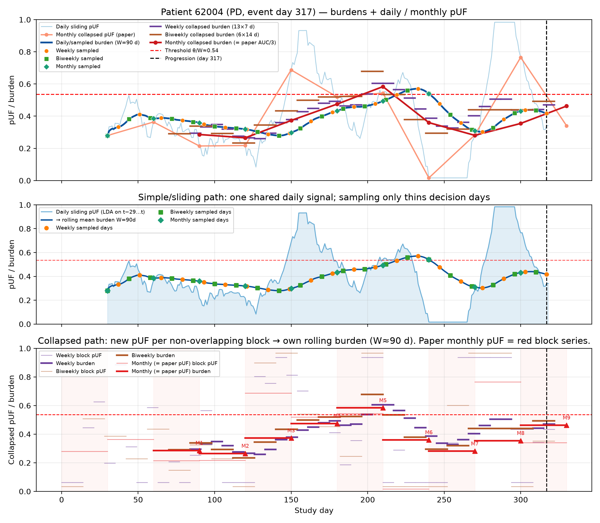

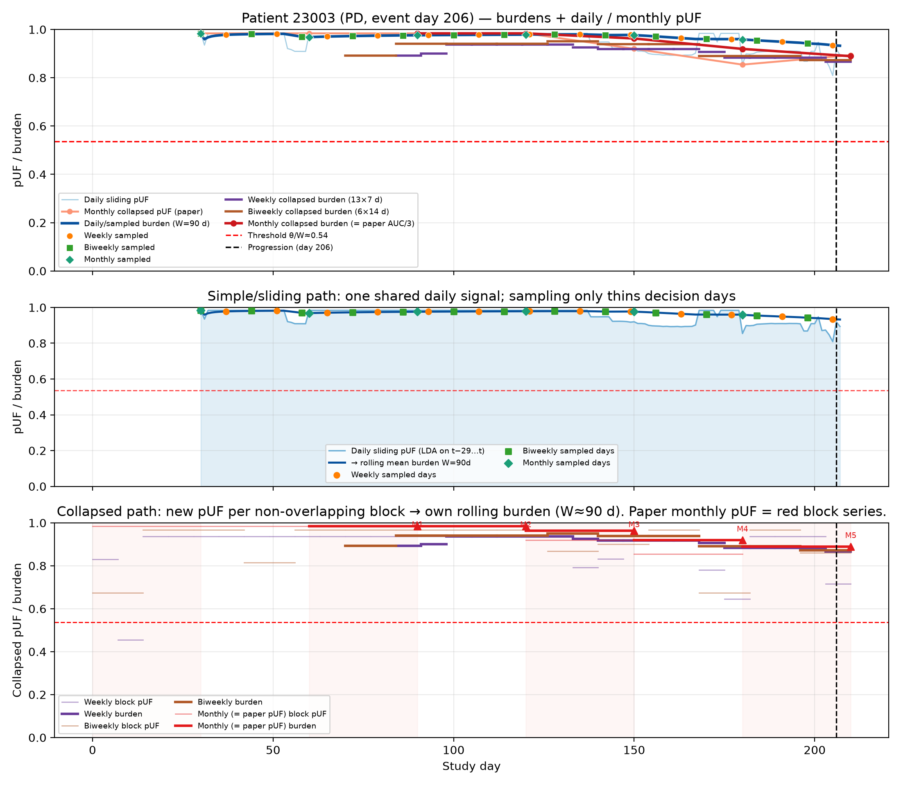

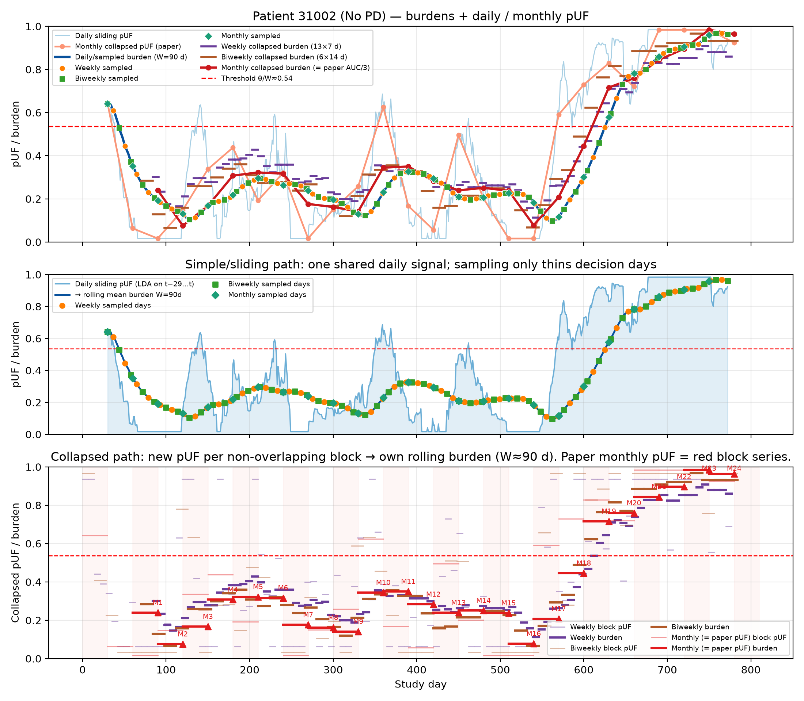

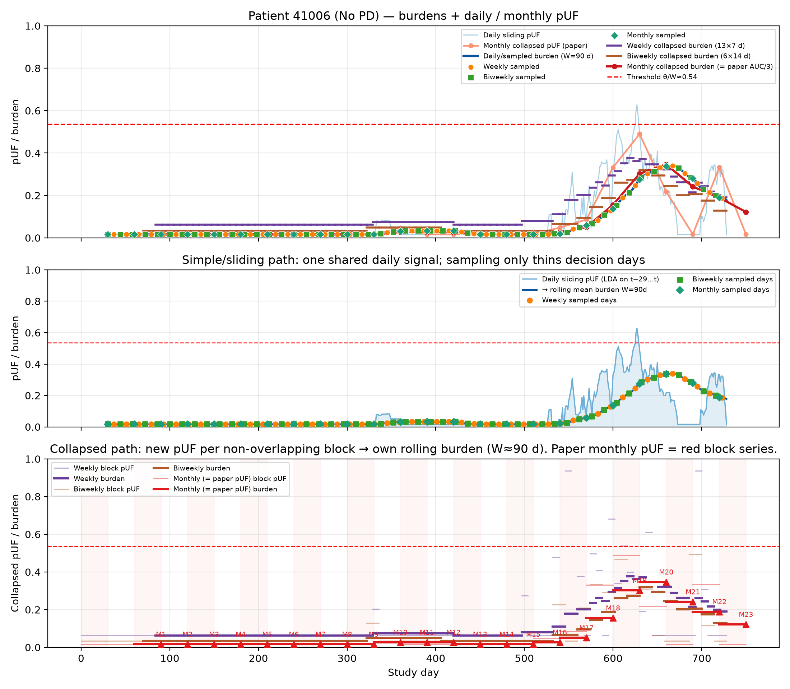

---

## 7. Cómo reproducir

```bash
# Baseline mensual + sweep ROC
.venv/bin/python scripts/03_analysis/alarm/run_granularity_sweep.py --monthly-only
.venv/bin/python scripts/03_analysis/alarm/run_granularity_sweep.py --skip-lda

# Mini experimento W×H (+ heatmaps)
.venv/bin/python scripts/03_analysis/alarm/analyze_missingness_and_wh_grid.py

# Trayectorias mensuales
.venv/bin/python scripts/03_analysis/alarm/plot_patient_trajectories.py \
  --patients 62004,23003,31002,41006

# Trayectorias sampled vs collapsed
.venv/bin/python scripts/03_analysis/alarm/plot_granularity_trajectories.py \
  --patients 62004,23003,31002,41006 --W 90
```

---

## 8. Conclusiones

1. **Submuestrear** la misma señal diaria (sampled) **no mejora** la discriminación: el AUC se estabiliza ~**0.68** en daily→monthly.  
2. **Colapsar** el LDA en bloques no solapados (7/14/30 d) **sí mejora** algo: AUC ~**0.70–0.71** (W=90 d, H=120 d).  
3. El **mejor punto** en ese setting es **weekly collapsed** (AUC **0.707**; Youden Sens/Spec ≈ 0.75/0.59).  
4. **↑W** (lookback) y **↑H** (horizonte) suben el AUC de forma ordenada; el ranking collapsed ≳ sampled se mantiene en el grid.  
5. El **PPV** permanece bajo (~**0.25**): la alarma discrimina, pero genera muchos falsos positivos a umbrales útiles.  
6. A nivel individual, el score puede anticipar PD (lead time), marcar burden alto persistente, o disparar alarmas tardías sin evento — útil para interpretación clínica, no solo para métricas agregadas.
